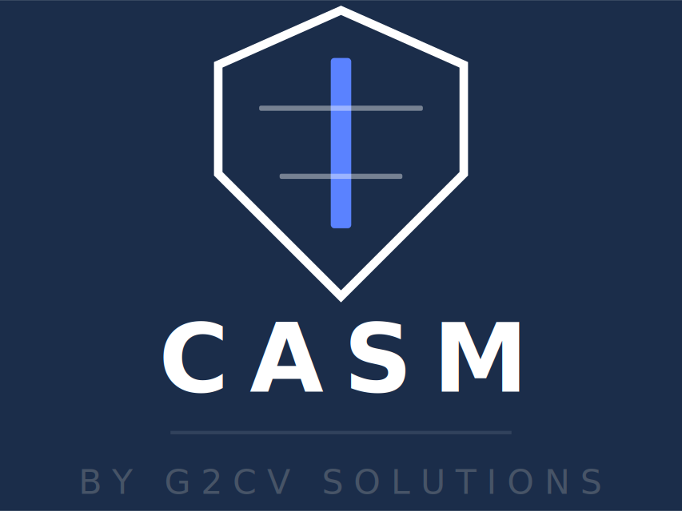
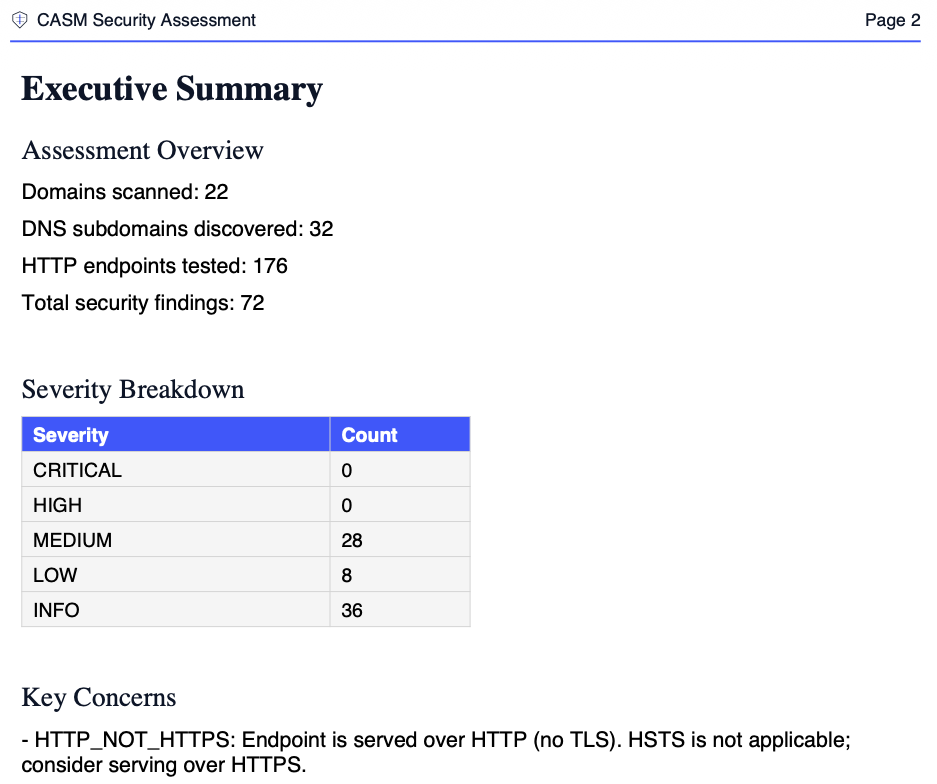
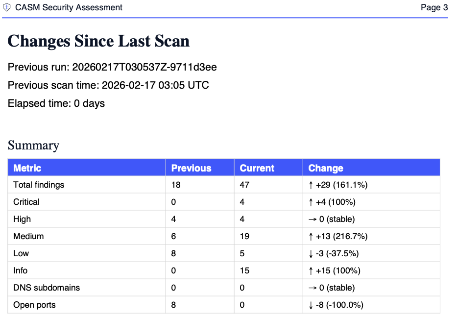

# CASM
## Continuous Attack Surface Monitoring



Evidence-first attack surface monitoring with safe, scope-bound verification and run-over-run change tracking.

CASM helps security teams continuously monitor external exposure in authorized environments. It discovers assets, verifies HTTP/TLS posture, and compares each run against a baseline to show exactly what changed.

## Quick Start

```bash
# Install
pip install g2cv-casm

# Run a unified scan
casm run unified --config scopes/scope.yaml --targets-file targets/target-harness.example.json

# Compare with a previous run
casm diff --old runs/baseline/results.sarif --new runs/current/results.sarif
```

## What CASM Does

- Discover exposed assets across HTTP, DNS, and TLS contexts.
- Verify web hardening signals and transport/security headers.
- Track change between scans with baseline-aware diffs.
- Report in SARIF, Markdown, PDF, and JSONL evidence streams.

## Safety by Default

- Authorization-first scope controls (domains, IPs, ports, protocols).
- Dry-run support, deterministic blocking reasons, and rate/concurrency guardrails.

## Screenshots

Executive Summary (PDF)


Changes Since Last Scan (PDF)


## Documentation

- Full docs: `docs/` (or run `mkdocs serve`)
- Tutorials: `docs/tutorials/`
- CLI reference: `docs/reference/cli.md`
- Configuration reference: `docs/reference/configuration.md`
- Security model: `docs/explanation/security-model.md`

## Project Notes

- Package name on PyPI: `g2cv-casm`
- CLI commands: `casm` and `g2cv-casm`
- Versioning is tag-driven (`vMAJOR.MINOR.PATCH`)

## Contributing and Security

- Contribution guide: `CONTRIBUTING.md`
- Security policy: `SECURITY.md`
- Code of conduct: `CODE_OF_CONDUCT.md`

## Support

If CASM is useful for your team, consider starring the repository.
It helps others discover the project and supports ongoing development.

## License

AGPL-3.0. See `LICENSE`.

Questions or partnerships: `contact@g2cv.com`
