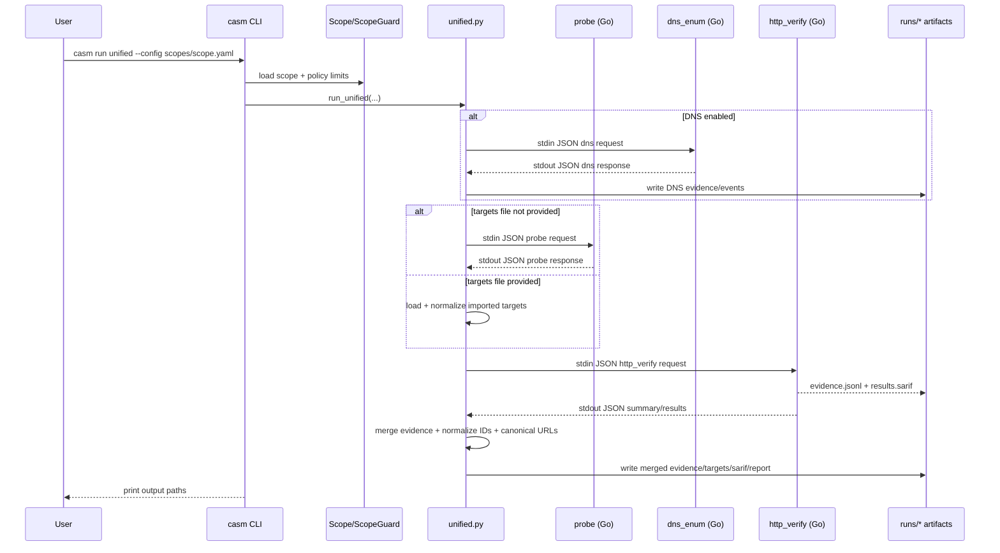
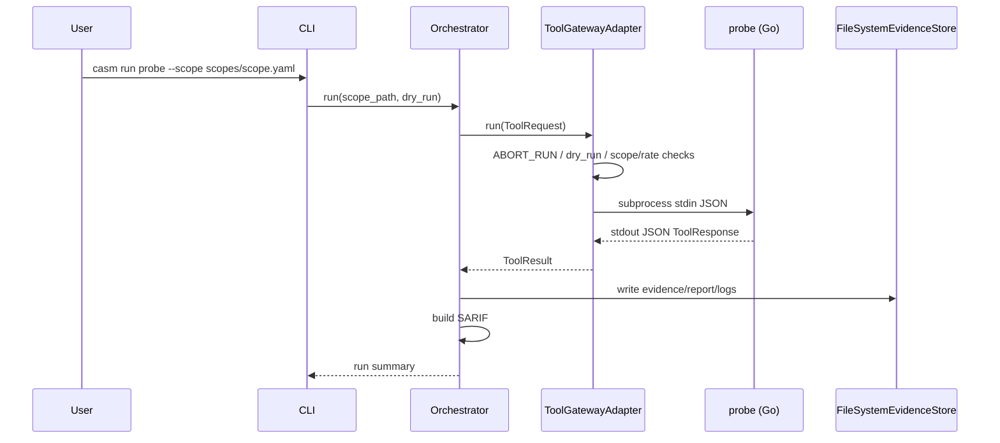
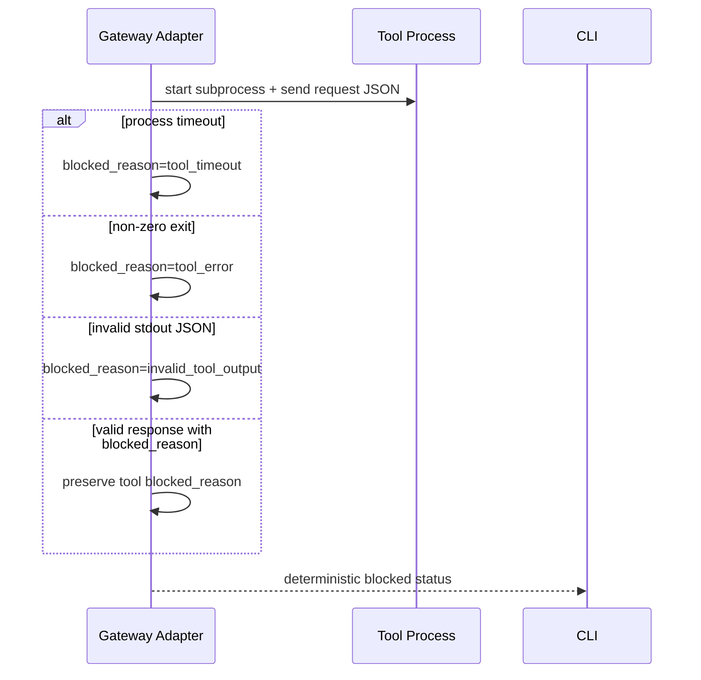

# Data Flow and Sequences

> **Prerequisites**
> - You read `docs/architecture/overview.md` first.

## End-to-End Unified Flow

## Probe-Only Flow

## Error Propagation Sequence

## Data Lifecycle

1. User passes CLI arguments.
2. Scope file is parsed into `Scope` dataclass.
3. Scope/rate constraints are applied before tool execution.
4. Go tool emits response + telemetry files.
5. Python normalizes:
   - schema version
   - canonical URL fields
   - stable IDs (`target_id`, `attempt_id`, fingerprints)
6. Final outputs are written and later consumed by:
   - `casm evidence`
   - `casm diff`
   - PDF generator

## State Ownership

- **In-memory transient state**
  - Tool request/response objects
  - Aggregation maps (findings, fingerprints)
- **Persistent state**
  - Run artifact directory under `runs/`
  - No database in this repository

💡 Tip: Treat `evidence.jsonl` as the source-of-truth event log. Reports are derived views.
