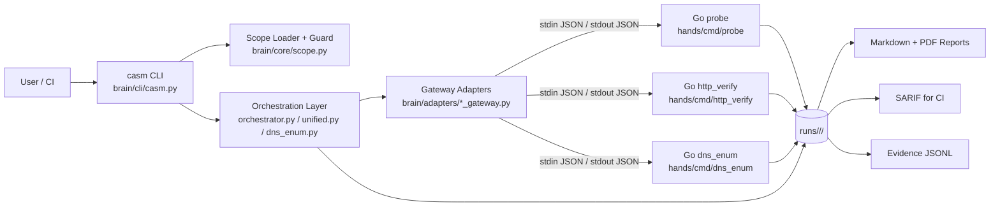

# Architecture Overview

> **Prerequisites**
> - You know basic Python and Go syntax.
> - You understand what JSON, CLI tools, and subprocesses are.

## System Diagram

## Brain vs Hands Metaphor

- **Brain (Python)**
  - Decides *what* to do and *whether* it is allowed.
  - Owns policy (`ScopeGuard`), orchestration order, evidence normalization, and reporting.
  - Does not perform low-level network probing itself.
- **Hands (Go)**
  - Performs *execution* of network actions (TCP connect, HTTP checks, DNS enumeration).
  - Optimized for concurrency and deterministic runtime behavior.
  - Returns machine-readable JSON only; business decisions happen in Python.

Concrete example:

- Python builds a `ToolRequest` for `probe` and enforces scope.
- Go `probe` scans host/ports and emits findings/evidence.
- Python stores artifacts, builds SARIF/report, and optionally performs diff/PDF generation.

## IPC Mechanisms (Inter-Process Communication)

CASM does **not** use gRPC, REST, shared memory, or FFI in this codebase.

It uses one IPC mechanism consistently:

- **Process boundary via `subprocess.run` + STDIN/STDOUT JSON**
  - Request path: Python serializes JSON and writes to child process stdin.
  - Response path: child process writes JSON to stdout.
  - Error path: non-zero exits, timeouts, and invalid JSON are mapped to deterministic blocked reasons.

Transport summary:

| Layer | Mechanism | Encoding | Contract |
|---|---|---|---|
| Python -> Go tool | stdin pipe | JSON | `contracts/schemas/*_request.schema.json` |
| Go tool -> Python | stdout pipe | JSON | `contracts/schemas/*_response.schema.json` |
| Tool telemetry | files | JSONL/SARIF | `evidence.jsonl`, `results.sarif` |

## Process and Concurrency Model

- Python process model:
  - Mostly single-threaded orchestration.
  - Spawns one tool process per stage.
- Go process model:
  - `probe`: sequential loop with ticker-based pacing.
  - `http_verify`: worker pool with goroutines + channels + mutex/atomic.
  - `dns_enum`: worker pool for active queries + mutex/atomic breaker.

Concurrency primitives used in Go:

- `sync.WaitGroup`
- `sync.Mutex`
- `sync/atomic`
- Channels for job queues and pacing ticks

⚠️ Warning: `hands/cmd/http_verify/main.go` updates summary counters from worker goroutines without explicit synchronization; run with race detector when modifying this path.

## Runtime Artifacts

Each run writes to `runs/<engagement_id>/<run_id>/`:

- `targets.jsonl`: normalized target inventory
- `evidence.jsonl`: event stream (JSON per line)
- `results.sarif`: machine-readable findings for CI
- `report.md`: human-readable report
- `report.pdf`: optional, generated in unified flow when requested
