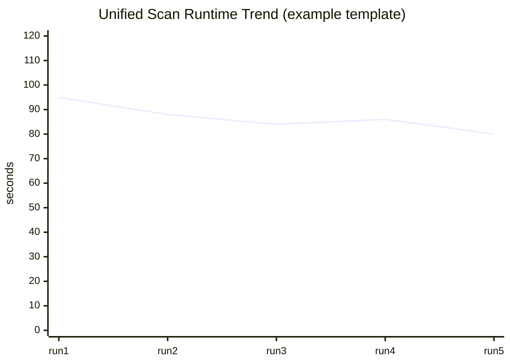

# Performance and Benchmarks

> **Prerequisites**
> - Controlled test targets
> - Ability to run multiple benchmark iterations

## Performance Characteristics by Stage

- Probe complexity: `O(targets * ports)`
- HTTP verify complexity: `O(targets * redirects)` plus header/TLS checks
- DNS enum complexity: `O(domains * record_types * candidates)`
- Evidence merge/report complexity: `O(events log events)` due to sorting

## Bottlenecks

- Network latency and TLS handshakes dominate runtime.
- DNS active enumeration scales with wordlist size.
- Serialization/file IO overhead grows with evidence volume.

## Benchmark Harness (Recommended)

Run 10 scans with fixed inputs and collect median/p95 runtime.

```bash
for i in {1..10}; do
  /usr/bin/time -f "%e" casm run unified --config scopes/scope.yaml --dry-run=false >/tmp/casm.$i.log 2>&1
done
```

## Example Trend Graph Template



Use this template with your measured values.

💡 Tip: Keep `max_rate` and `max_concurrency` constant when comparing runs; otherwise runtime comparisons are not meaningful.
